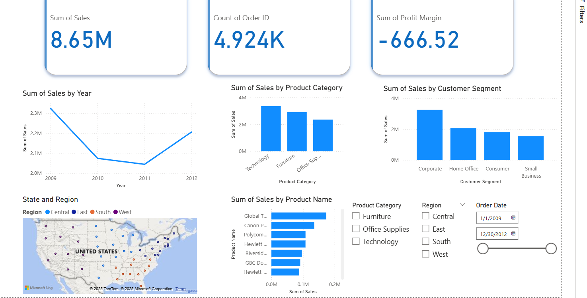

# 📊 Sales Performance Dashboard  

## Overview  
This dashboard analyzes **sales performance from 2009–2012** across different **products, customer segments, and regions**. It provides insights into revenue trends, order volume, and profitability, helping business stakeholders understand which areas are driving sales and which may require improvement.  

---

## 🔑 Business Question  
**How are sales and profitability distributed across products, customer segments, and regions, and what trends can we observe over time?**  

---

## 🎯 Key Insights  
- **Total Sales:** $8.65M across ~4.9K orders  
- **Profitability Concern:** Despite strong sales, overall profit margin is **negative (-$666.52)**, indicating potential pricing or cost issues  
- **Sales Trends:** Sales peaked in 2009 (~$2.3M), dipped in 2010–2011, and recovered slightly in 2012  
- **Product Categories:** Technology leads in sales, followed by Furniture and Office Supplies  
- **Customer Segments:** Corporate clients account for the majority of sales, while small businesses contribute the least  
- **Geography:** Sales are spread across U.S. regions, with notable density in the East and Central regions  

---

## 🛠️ Features  
- **KPI Cards:** Total Sales, Number of Orders, and Profit Margin at a glance  
- **Trend Analysis:** Sales by Year shows performance over time  
- **Breakdowns:**  
  - By Product Category  
  - By Customer Segment  
  - By Individual Product Name  
  - By U.S. Region (map visualization)  
- **Interactive Filters:** Slice the data by date range, product category, and region  

---

## 📈 Business Value  
This dashboard enables decision-makers to:  
- Identify **high-revenue products** and customer segments  
- Detect **profitability issues** despite strong sales  
- Understand **regional performance** for targeted strategies  
- Track sales trends to measure recovery or decline over time  

---

## ⚙️ Tools & Technologies  
- **Power BI Desktop** → dashboard design and visualization  
- **Power Query** → data cleaning and transformation  
- **Data Modeling** → building relationships between tables for analysis  
- **Excel Dataset** → source data used for this project  

---

## 📸 Dashboard Preview  
  

---

## 🚀 How to Use  
1. Open the `.pbix` file in Power BI Desktop  
2. Use the slicers (filters) to explore sales by region, product category, and time period  
3. Hover over visuals for tooltips with additional details  
